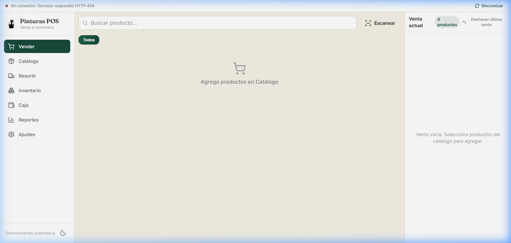
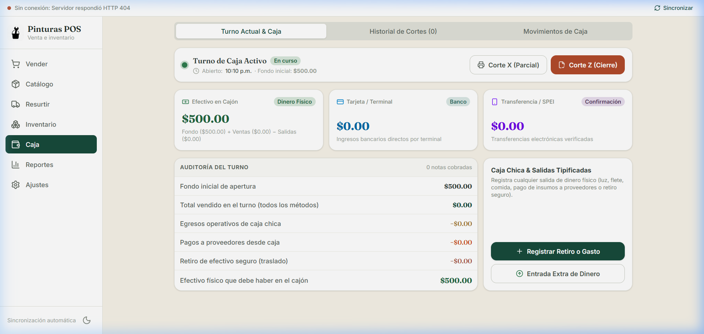
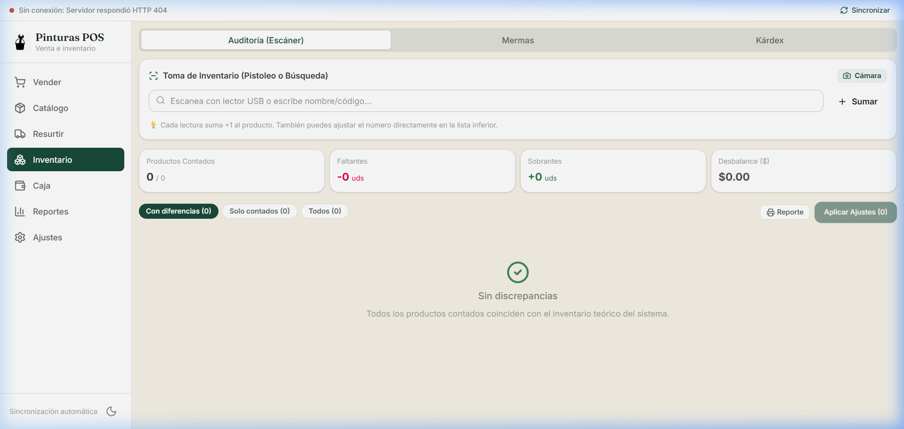
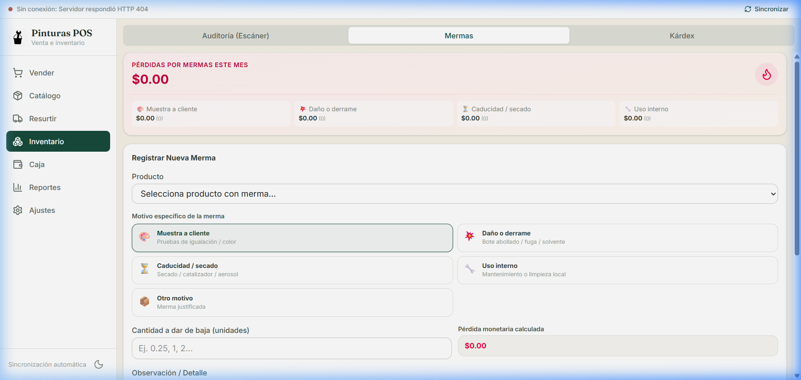
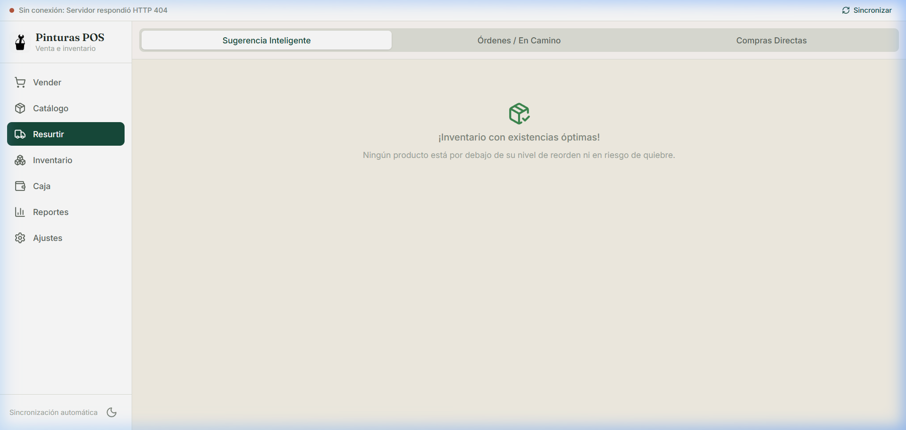
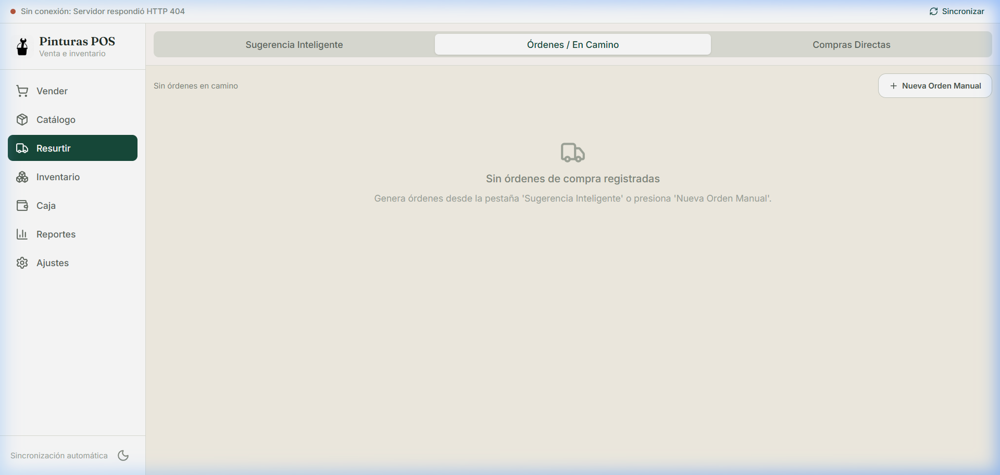
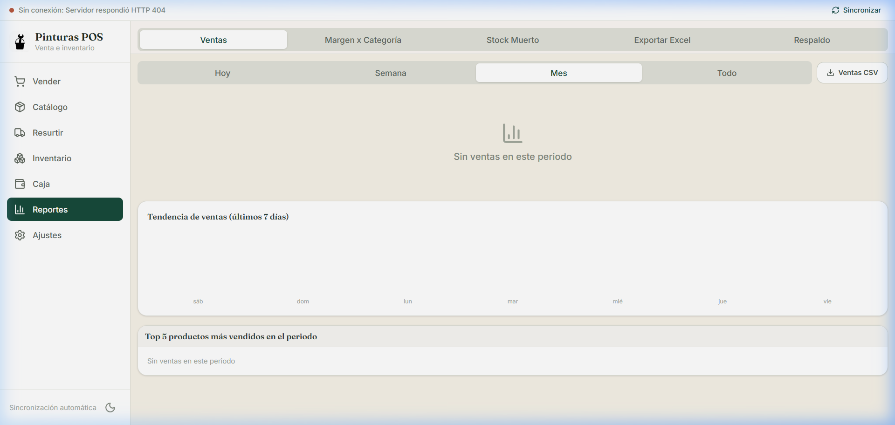
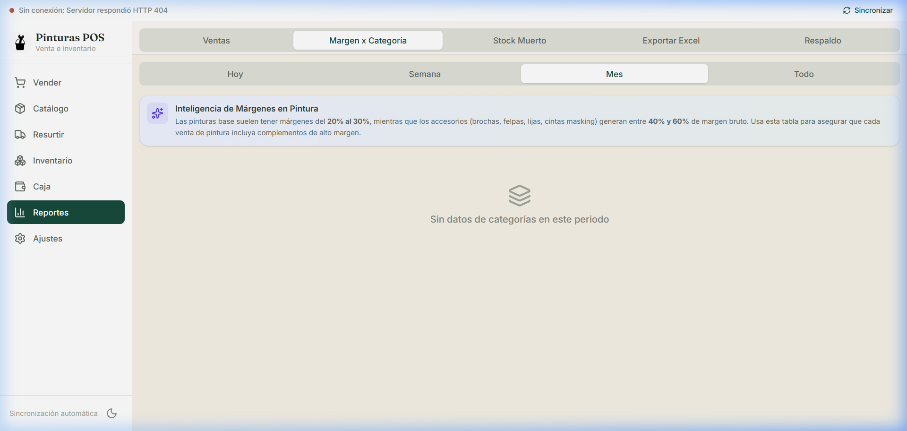
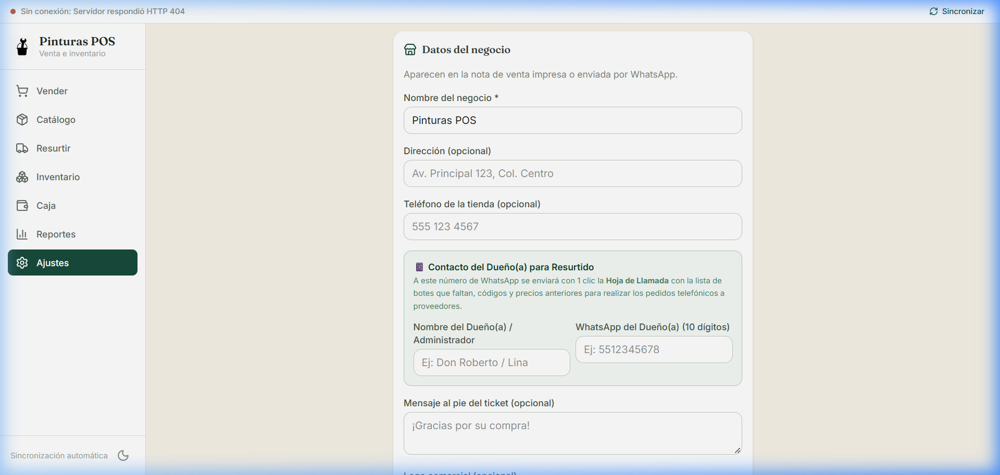

# 📖 Manual de Usuario Integral — Pinturas POS
### *Sistema Operativo Comercial para Tiendas de Pintura, Recubrimientos y Ferretería*

---

## 🎯 Bienvenida e Introducción

Bienvenido a **Pinturas POS**, la plataforma integral diseñada especialmente para agilizar el mostrador, blindar el dinero de la caja y optimizar las compras y el inventario de tu tienda de pinturas.

Este sistema cuenta con una arquitectura **Local-First**, lo que significa que **la tienda nunca se detiene aunque se caiga el internet**: las ventas, cobros, arqueos y consultas de existencias se procesan de forma inmediata en el dispositivo.

---

## 🔐 1. Acceso Seguro a la Tienda (PIN de Seguridad)

Para proteger la información sensible de ventas y evitar accesos no autorizados, el sistema cuenta con un teclado numérico táctil de acceso:

1. Al abrir la aplicación por primera vez, el sistema te solicitará ingresar y confirmar un **PIN de 4 dígitos** (por ejemplo, `1234`).
2. Cada vez que abras la tienda en una nueva sesión o tras bloquear la pantalla, ingresa tu PIN de 4 dígitos para acceder al sistema.
3. El PIN protege el acceso inmediato a caja, inventario y reportes financieros.

---

## 🛒 2. Módulo de Venta en Mostrador (Punto de Venta)

El módulo **Vender** es el corazón del mostrador diario. Está diseñado para despachar clientes en segundos utilizando el teclado, la pantalla táctil o la pistola lectora de código de barras.

### 📋 Pasos para Realizar una Venta:

1. **Buscar o Escanear el Producto:**
   * **Pistoleo rápido:** Con el lector de código de barras conectado (USB o Bluetooth), simplemente apunta al envase; el sistema agrega automáticamente la pieza al carrito y reproduce un sonido de confirmación.
   * **Buscador de texto:** Escribe el nombre del color, tipo de pintura o código en el campo *"Buscar producto por nombre o código..."*.
   * **Cámara de celular:** Presiona el botón **Cámara** si estás usando un celular o tablet para escanear directamente con la cámara del dispositivo.
   * **Filtros por categoría:** Presiona las etiquetas rápidas (*Esmaltes, Vinílicas, Impermeabilizantes, Solventes, Accesorios*) para navegar visualmente por el catálogo.

2. **Ajustar Cantidades y Presentaciones:**
   * En el carrito del lado derecho, puedes ajustar las piezas con los botones `+` y `-`.
   * Si el producto cuenta con presentaciones configuradas (ej. Litro, Galón, Cubeta de 19L o Cajas), puedes seleccionar la unidad correspondiente; el sistema calcula el precio y descuenta la fracción exacta del stock.

3. **Cobrar y Generar Nota:**
   * Presiona el botón verde **Cobrar**.
   * Selecciona el método de pago:
     * 💵 **Efectivo** (calcula el cambio automáticamente).
     * 💳 **Tarjeta / Terminal bancaria**.
     * 📱 **Transferencia / SPEI**.
   * Presiona **Confirmar Venta**.
   * Aparecerá la ventana para imprimir el ticket en mini-printer térmica, descargar el PDF o presionar **"Enviar por WhatsApp"** para mandarle el comprobante digital al cliente.

> [!TIP]
> Si te equivocaste en la última venta, el sistema cuenta con el botón **"Deshacer última venta"** en la parte inferior para cancelar el ticket de inmediato y devolver el stock a su lugar.

---

## 💵 3. Módulo de Control de Caja & Arqueo Ciego (Cortes X y Z)

Diseñado para blindar el efectivo en el cajón, evitar descuadres al final del día y tener claridad absoluta de cuánto dinero físico debe haber en el mostrador.

### 🟢 3.1 Apertura de Turno (Fondo Inicial)
1. Al iniciar la jornada, presiona **"Abrir Turno de Caja"**.
2. Ingresa el monto de cambio inicial asignado al cajero (por ejemplo, `$500.00 MXN`).
3. Opcionalmente indica el nombre del cajero en turno y presiona **"Iniciar Turno"**.

### 📊 3.2 Separación Estricta por Método de Pago
En la parte superior verás 3 tarjetas independientes que nunca se mezclan:
* **💵 Efectivo en Cajón:** Es el dinero físico que se puede contar y tocar en la gaveta.
* **💳 Tarjeta / Terminal:** Ingresos electrónicos acreditados en la cuenta bancaria.
* **📱 Transferencia / SPEI:** Pagos recibidos por banca móvil.

### 💸 3.3 Registro de Salidas y Gastos de Caja Chica Tipificados
Para evitar que se tome dinero del cajón sin registro:
1. En la sección **Caja Chica & Salidas Tipificadas**, presiona **"Registrar Retiro o Gasto"**.
2. Selecciona la subcategoría correcta:
   * **Gasto operativo:** Pago de recibo de luz, agua, comida del personal, flete o papelería.
   * **Pago a proveedores:** Abono en efectivo o compra de insumos de contado.
   * **Retiro seguro:** Traslado de dinero físico del cajón a la caja fuerte o depósito bancario.
3. Ingresa el concepto y el monto. El sistema descuenta la salida del dinero esperado en el cajón.

### 🔒 3.4 Cortes de Caja: Corte X y Corte Z

| Tipo de Corte | ¿Cuándo se hace? | ¿Cómo funciona? |
| :--- | :--- | :--- |
| **Corte X (Parcial)** | A mitad del día o cambio de guardia | Muestra un resumen informativo en pantalla de las ventas y dinero acumulado **sin cerrar el turno**. Permite imprimir o descargar un comprobante parcial. |
| **Corte Z (Arqueo Ciego / Cierre de Día)** | Al terminar el día o cerrar la tienda | El cajero cuenta físicamente el dinero del cajón y escribe el monto contado **sin ver lo que el sistema calcula**. |

**Al confirmar el Corte Z:**
* El sistema compara:
  $$\text{Diferencia} = \text{Efectivo Físico Contado} - \text{Efectivo Esperado por Sistema}$$
* Muestra de inmediato si el cajero entregó el dinero exacto, si hubo **sobrante (+)** o si hubo un **faltante (-)**.
* Se genera automáticamente el **Ticket de Corte Z en PDF** con el balance final para archivo contable del dueño.

---

## 📦 4. Módulo de Inventario: Auditoría por Escáner & Mermas

Este módulo garantiza que lo que dice la computadora sea idéntico a lo que realmente hay en los anaqueles de la tienda.

### 🔫 4.1 Auditoría Física Continua por Escáner
En lugar de pasar horas contando botes con papel y lápiz:

1. Ve a **Inventario** $\rightarrow$ pestaña **Auditoría (Escáner)**.
2. Toma la pistola de código de barras o la cámara de tu celular.
3. Ve caminando por los pasillos y pistolea cada bote:
   * Cada escaneo emite un `beep` de éxito y suma **+1 al conteo**.
   * Si hay una pila de 10 botes, puedes pistolear uno y escribir directamente `10` en el campo.
4. Conforme escaneas, el sistema construye la **Matriz de Discrepancias**:
   * Te muestra cuántos productos cuadraron al 100%, cuáles tienen **faltantes** y cuáles tienen **sobrantes**, junto con el **impacto en dinero ($)**.
5. Al terminar, presiona **"Aplicar Ajustes"**: el sistema sincroniza las existencias reales en un solo clic y deja registrado el ajuste contable.

---

### 🎨 4.2 Registro de Mermas Específicas de Pintura
En una tienda de pinturas no todo faltante es un robo; hay pérdidas naturales del oficio:

1. Ve a **Inventario** $\rightarrow$ pestaña **Mermas**.
2. Presiona **"Registrar Nueva Merma"**.
3. Selecciona el producto y elige el motivo tipificado:
   * 🎨 **Muestra a cliente:** Litros o cuartos usados para igualación y pruebas de color en mostrador.
   * 💥 **Daño o derrame:** Botes abollados en descarga, fugas o solvente evaporado.
   * ⏳ **Caducidad / secado:** Catalizadores, aerosoles o selladores secos en anaquel.
   * 🔧 **Uso interno:** Pintura usada para mantenimiento de la fachada o limpieza del local.
4. Escribe la cantidad mermada y una breve nota.
5. El sistema descuenta el stock y acumula el costo en el reporte mensual de pérdidas por merma.

---

## 🚚 5. Módulo de Resurtido Inteligente & Pedidos

Diseñado para que la tienda **nunca se quede sin pintura** y para que el dueño realice los pedidos a proveedores por llamada telefónica de forma exacta y sin aumentos de precio imprevistos.

### 🧠 5.1 Sugerencia Inteligente por Proveedor
El sistema cruza tus **productos más vendidos (Top ventas de 30 días)** contra el tiempo que tarda en surtir cada proveedor (*Lead Time*):

* Agrupa la lista de compras por marca (**Comex, Sayer, Berel, Truper**).
* Cada tarjeta muestra la **foto del producto**, su nivel de stock actual, si es un producto `🔥 Top Vendido` o si está `🚨 AGOTADO`.
* Te sugiere la cantidad exacta a pedir con botones rápidos `+` y `-`.

### 📞 5.2 "Hoja de Llamada para el Dueño" (WhatsApp & PDF)
Dado que el dueño de la tienda suele hacer los pedidos vía llamada telefónica con los agentes de ventas:
1. En la cabecera del proveedor, presiona:  
   👉 **"Enviar al Dueño (WhatsApp)"**.
2. El dueño recibe en su celular un mensaje estructurado con:
   * Qué botes pedir y cuántos quedan en bodega.
   * **El último costo de compra pagado** (para negociar y evitar que el vendedor suba el precio en la llamada).
   * Los códigos de catálogo del fabricante.
   * Total estimado de la compra.
3. También cuenta con el botón **"PDF Llamada"** para descargar una hoja membretada de pedido si prefiere tenerla impresa.

---

### 📥 5.3 Órdenes en Camino y Recepción por Escáner en Descarga
Una vez acordado el pedido con el proveedor:

1. Presiona **"Crear Pedido"**; la orden pasa a la pestaña **Órdenes / En Camino**.
2. **El día que llega el camión del proveedor a la tienda:**
   * Abre la orden y presiona **"Escanear para Recibir Mercancía"**.
   * Conforme los trabajadores bajan los botes del camión, ve pistoleando:
     * Si el bote viene en la orden: emite un sonido agudo y avanza el checklist `(ej. 8 de 10 recibidos)`.
     * Si escaneas un producto ajeno que no pediste: emite una alerta sonora advirtiendo el error.
   * Si el proveedor cambió el precio en la factura, puedes ajustar el costo unitario en el renglón.
3. Presiona **"Finalizar Recepción"**: **en ese instante el sistema suma todas las unidades recibidas al stock de la tienda** y genera la compra contable.

---

## 📊 6. Módulo de Analítica de Negocio & Reportes para el Contador

Permite tomar decisiones comerciales basadas en datos reales para maximizar las ganancias y no tener dinero estancado.

### 📈 6.1 Ventas y Gráfica de Tendencia
Permite consultar ingresos totales, utilidad neta, desglose de cobro (efectivo, tarjeta, transferencias) y la gráfica de tendencia de los últimos 7 días con el Top 5 de artículos más vendidos.

---

### 🎨 6.2 Rentabilidad y Margen Real por Categoría
En pinturas, los accesorios (brochas, felpas, lijas, cintas masking) dejan entre **40% y 60%** de margen, mientras que la pintura base deja entre **20% y 30%**.

* Muestra el porcentaje de margen bruto por cada familia de productos.
* Incluye una barra de progreso que indica qué porcentaje de la ganancia global de la tienda aporta cada categoría.
* Permite verificar si tus empleados están ofreciendo complementos de alto margen con cada lata de pintura vendida.

---

### ⏳ 6.3 Alerta de Stock Muerto (Capital Inmovilizado)
Detecta productos que tienen existencias en anaquel pero no registran ninguna venta en más de **45, 60 o 90 días** (o nunca vendidos):
* Calcula en pesos el **Capital Estancado a Costo** (dinero congelado en anaquel).
* Sugiere acciones comerciales: *Promoción 2x1, Combo con pintura base o Liquidación urgente*.
* Permite descargar la lista en Excel para armar ofertas de fin de semana.

---

### 📑 6.4 Centro de Exportaciones Contables para Excel (.csv UTF-8)
En la pestaña **Exportar Excel** tienes 3 reportes oficiales con formato compatible con Microsoft Excel (sin descuadres ni caracteres raros):
1. **Reporte de Ventas Detallado:** Ticket por ticket y renglón por renglón con costos, utilidades y formas de pago.
2. **Compras & Gastos de Caja Chica:** Salidas operativas, pagos a proveedores y compras de mercancía.
3. **Valuación Contable de Inventario Total:** Auditoría de todo el catálogo con existencias, valor total a costo y valor proyectado a precio de venta con la suma general del activo de la tienda.

---

## ⚙️ 7. Configuración del Negocio & Teléfono del Dueño

En la pestaña **Ajustes** se configuran los datos institucionales que aparecen en los tickets y comprobantes:

### 📋 Campos Principales:
* **Nombre del negocio:** Aparece en el encabezado de todas las notas y reportes.
* **Dirección y Teléfono de mostrador:** Información de contacto para tus clientes.
* **Contacto del Dueño(a) para Resurtido:**
  * **Nombre del Dueño/Administrador:** (ej. *Don Roberto / Lina*).
  * **WhatsApp del Dueño(a) a 10 dígitos:** Número al que el sistema enviará en automático la Hoja de Llamada cuando se requiera hacer pedidos de resurtido.
* **Mensaje al pie:** Agradecimiento o políticas de devolución impresas al final del ticket.
* **Logo comercial:** Sube la imagen de tu logotipo para personalizar notas y comprobantes.

---

## 💡 Resumen de Buenas Prácticas Diarias para el Personal

1. **Al iniciar el día:**
   * Abrir el turno en **Caja** registrando el fondo inicial para cambio.
2. **Durante la jornada:**
   * Cobrar todas las operaciones en **Vender** especificando si el pago fue en efectivo, tarjeta o transferencia.
   * Registrar cualquier gasto de caja chica (comida, fletes, luz) en **Caja $\rightarrow$ Registrar Retiro**.
3. **Al recibir pedidos de proveedores:**
   * Ir a **Resurtir $\rightarrow$ Órdenes** y usar **Escanear para Recibir** para asegurar que el camión entregue las piezas exactas facturadas.
4. **Al cerrar la tienda:**
   * Ir a **Caja** y presionar **Corte Z (Arqueo Ciego)**.
   * Contar el dinero físico del cajón, registrar el monto y descargar el ticket de cierre para entregar al dueño.
5. **Cada semana / mes:**
   * Hacer auditoría de anaqueles con el escáner en **Inventario**.
   * Revisar el **Stock Muerto** y descargar los reportes de **Exportar Excel** para la contabilidad.
